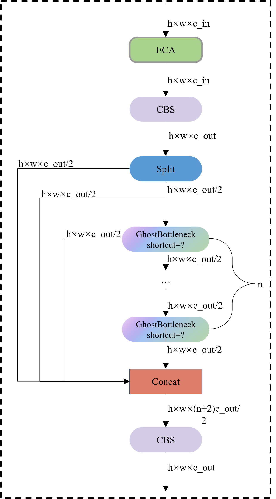
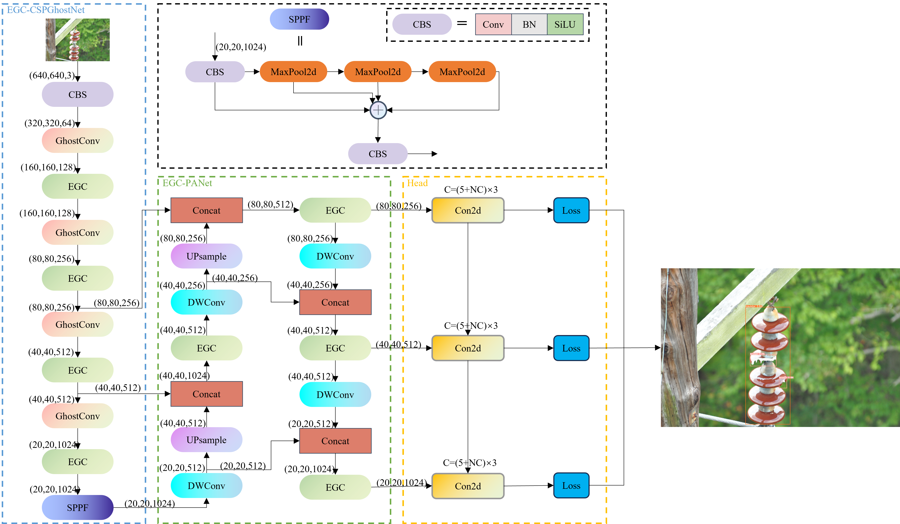

# LiteYOLO-ID: A Lightweight Object Detection Network for Insulator Defect Detection


## <div align="left">Quick Start Examples</div>

<details open>
<summary>Install</summary>

First, clone the project and configure the environment.
[**Python>=3.7.0**](https://www.python.org/), [**PyTorch>=1.7**](https://pytorch.org/get-started/locally/).

```bash
git clone https://github.com/LuYang-2023/Insulator-defect-detection.git  # clone
cd Insulator-defect-detection
pip install -r requirements.txt  # install
```
</details>

<details open>
<summary>Train</summary>


```python
python train.py --cfg models/LiteYOLO-ID.yaml --data data/mydata.yaml
```
</details>


<details>
<summary>Test</summary>


```bash
python val.py --data data/mydata.yaml --weights best.pt --task test
```
</details>

## Summary
Insulator defect detection is of great significance to ensure the normal operation of power transmission and distribution networks. In response to the problems of low speed, low accuracy, and difficulty in deploying to embedded terminals in existing insulator defect detection, this paper proposes a lightweight insulator defect detection model based on an improved YOLOv5s, named LiteYOLO-ID. Firstly, to significantly reduce the model parameters while maintaining detection accuracy, we design a new lightweight convolution module called EGC (ECA-GhostNet-C2f). Secondly, based on the EGC module, we construct the EGC-CSPGhostNet backbone network, which optimizes the feature extraction process and achieves model compression. Additionally, we design a lightweight neck network, EGC-PANet, to further reduce the parameter count and achieve efficient feature fusion. Experimental results show that on the IDID-Plus dataset, compared to the original YOLOv5s model, not only does LiteYOLO-ID reduce the model parameters by 47.13%, but it also improves the mAP(0.5) by 1%. Furthermore, the generalization of the model is validated on the Pascal VOC dataset and the SFID dataset. Importantly, after TensorRT optimization, the inference speed of the LiteYOLO-ID algorithm on the Jetson TX2 NX reaches 20.2 FPS, meeting the real-time detection requirements of insulator defects.


## EGC Schematic Diagram
The lightweight convolutional module EGC incorporates the design philosophies of GhostNet and C2f modules, significantly enhancing the capture of key information in detection targets through the ECA attention mechanism. The structural diagram of the EGC module is shown below.

<div align="center">
    
</div>


## LiteYOLO-ID Schematic Diagram

<div align="center">
    
</div>

## Dataset
My dataset contains sensitive information from the Tianjin Power Grid Company, and I need to communicate with them first to confirm whether this data can be made public. 


## Experimental flow chart


## Actual detection output on Jetson TX2 NX
The hardware and software configuration of the Jetson TX2 NX includes an NVIDIA Pascal GPU, with PyTorch version 1.8.0 and CUDA version 10.2.


## Detection result


### Citation
If you use this code or article in your research, please cite it using the following BibTeX entry:

```bibtex
@ARTICLE{10569022,
  author = {Li, Dahua and Lu, Yang and Gao, Qiang and Li, Xuan and Yu, Xiao and Song, Yu},
  title = {LiteYOLO-ID: A Lightweight Object Detection Network for Insulator Defect Detection},
  journal = {IEEE Transactions on Instrumentation and Measurement},
  year = {2024},
  volume = {73},
  pages = {1-12},
  doi = {10.1109/TIM.2024.3418082},
  keywords = {Insulators, Accuracy, Computational modeling, Defect detection, YOLO, Feature extraction, Neck, Deep learning, insulator defect detection, lightweight, quantification, deployment}
}
```


## Author's Contact
Email：yj20220275@stud.tjut.edu.cn
