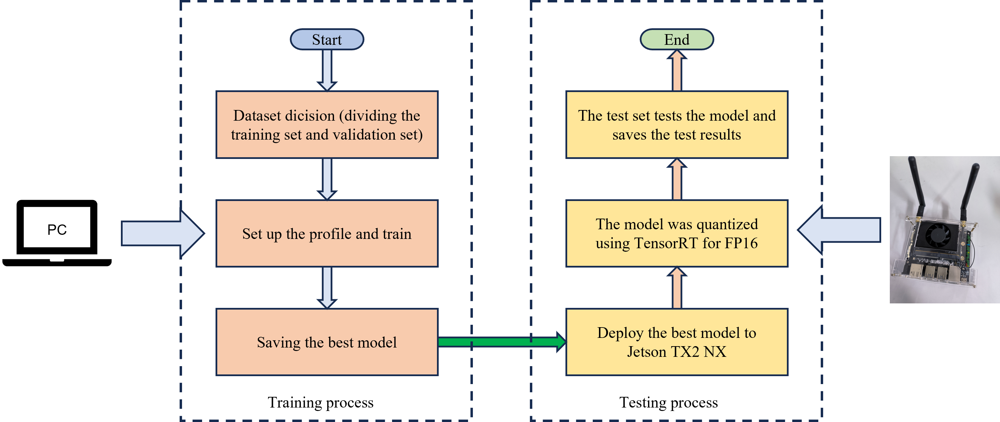
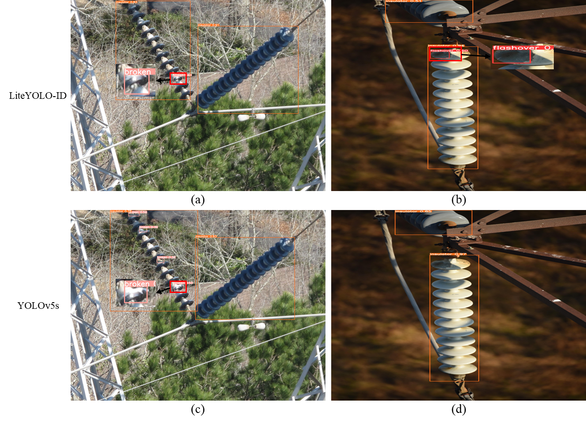
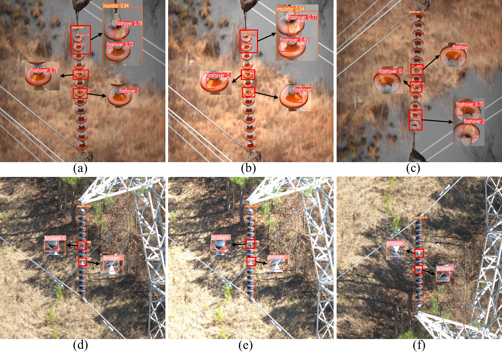

# LiteYOLO-ID: A Lightweight Object Detection Network for Insulator Defect Detection

**Dear reviewers: The source code and pre-trained model weights will be available upon the acceptance of the paper.   Feel free to raise your questions or difficulties in the implementation.**

Paper submission number TIM-23-08169R1 was submitted to ieee transactions on instrumentation and measurement.

## <div align="left">Quick Start Examples</div>

<details open>
<summary>Install</summary>

First, clone the project and configure the environment.
[**Python>=3.7.0**](https://www.python.org/), [**PyTorch>=1.7**](https://pytorch.org/get-started/locally/).

```bash
git clone https://github.com/LuYang-2023/ICMA2024.git  # clone
cd ICMA2024
pip install -r requirements.txt  # install
```
</details>

<details open>
<summary>Train</summary>


```python
python train.py --cfg models/IDD-yolov5.yaml --data data/mydata.yaml
```
</details>


<details>
<summary>Test</summary>


```bash
python val.py --data data/mydata.yaml --weights best.pt --task test
```
</details>

## Summary
Insulator defect detection is of great significance to ensure the normal operation of power transmission and distribution networks. In response to the problems of low speed, low accuracy, and difficulty in deploying to embedded terminals in existing insulator defect detection, this paper proposes a lightweight insulator defect detection model based on an improved YOLOv5s, named LiteYOLO-ID. Firstly, to significantly reduce the model parameters while maintaining detection accuracy, we design a new lightweight convolution module called EGC (ECA-GhostNet-C2f). Secondly, based on the EGC module, we construct the EGC-CSPGhostNet backbone network, which optimizes the feature extraction process and achieves model compression. Additionally, we design a lightweight neck network, EGC-PANet, to further reduce the parameter count and achieve efficient feature fusion. Experimental results show that on the IDID-Plus dataset, compared to the original YOLOv5s model, not only does LiteYOLO-ID reduce the model parameters by 47.13%, but it also improves the mAP(0.5) by 1%. Furthermore, the generalization of the model is validated on the Pascal VOC dataset and the SFID dataset. Importantly, after TensorRT optimization, the inference speed of the LiteYOLO-ID algorithm on the Jetson TX2 NX reaches 20.2 FPS, meeting the real-time detection requirements of insulator defects.


## EGC Schematic Diagram
The EGC module structure diagram will be released after the paper is published.

## LiteYOLO-ID Schematic Diagram
The LiteYOLO-ID architecture diagram will be released after the paper is published.

## Dataset
The full data set will be published later.

## Experimental flow chart


## Actual detection output on Jetson TX2 NX
The hardware and software configuration of the Jetson TX2 NX includes an NVIDIA Pascal GPU, with PyTorch version 1.8.0 and CUDA version 10.2.


## Detection result





## Author's Contact
Email：ly13063414159@163.com
