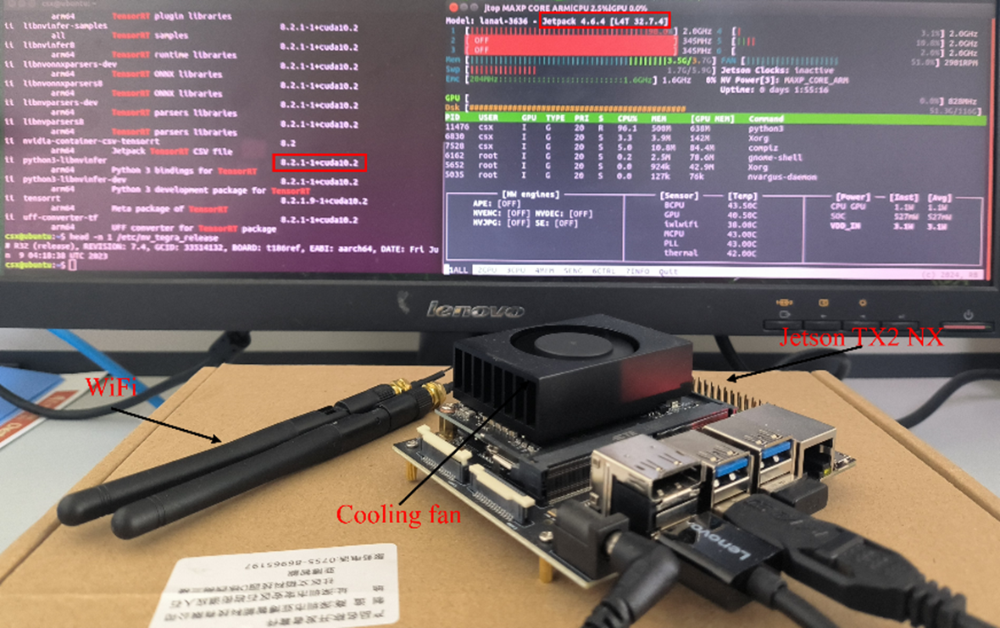

# LiteYOLO-ID: A Lightweight Object Detection Network for Insulator Defect Detection

## Introduction
This is our PyTorch implementation of the paper "[`LiteYOLO-ID: A Lightweight Object Detection Network for Insulator Defect Detection`](https://doi.org/10.1109/tim.2024.3418082)" published in ***IEEE Transactions on Instrumentation and Measurement***.

<div align="center">
    
</div>


## <div align="left">Quick Start Examples</div>

<details open>
<summary>Install</summary>

First, clone the project and configure the environment.
[**Python>=3.7.0**](https://www.python.org/), [**PyTorch>=1.7**](https://pytorch.org/get-started/locally/).

```bash
git clone https://github.com/LuYang-2023/Insulator-defect-detection.git  # clone
cd Insulator-defect-detection
pip install -r requirements.txt  # install
```
</details>

<details open>
<summary>Train</summary>


```python
python train.py --cfg models/LiteYOLO-ID.yaml --data data/mydata.yaml
```
</details>


<details>
<summary>Test</summary>


```bash
python val.py --data data/mydata.yaml --weights best.pt --task test
```
</details>


## EGC Schematic Diagram
The lightweight convolutional module EGC incorporates the design philosophies of GhostNet and C2f modules, significantly enhancing the capture of key information in detection targets through the ECA attention mechanism. The structural diagram of the EGC module is shown below.

<div align="center">
    
</div>


## Dataset
I will first provide links to Baidu.com discs for some of the datasets. More specific datasets involve confidential information from Tianjin Grid, and I need to discuss with them whether they can be made public. However, the datasets I provided are sufficient for code debugging and model training. The links to the datasets are below:

Link: https://pan.baidu.com/s/1inULMZcnibOsfjXvJQiFjQ

Extraction code: 8kdy

## Experimental flow chart

<div align="center">
    
</div>

## Actual detection output on Jetson TX2 NX
The hardware and software configuration of the Jetson TX2 NX includes an NVIDIA Pascal GPU, with PyTorch version 1.8.0 and CUDA version 10.2.

<div align="center">
    
</div>

## Detection result
<div align="center">
    
</div>

<div align="center">
    
</div>


### Citation
If you use this code or article in your research, please cite it using the following BibTeX entry:

```bibtex
@ARTICLE{10569022,
  author = {Li, Dahua and Lu, Yang and Gao, Qiang and Li, Xuan and Yu, Xiao and Song, Yu},
  title = {LiteYOLO-ID: A Lightweight Object Detection Network for Insulator Defect Detection},
  journal = {IEEE Transactions on Instrumentation and Measurement},
  year = {2024},
  volume = {73},
  pages = {1-12},
  doi = {10.1109/TIM.2024.3418082},
  keywords = {Insulators, Accuracy, Computational modeling, Defect detection, YOLO, Feature extraction, Neck, Deep learning, insulator defect detection, lightweight, quantification, deployment}
}
```


## Author's Contact
Email：yj20220275@stud.tjut.edu.cn
